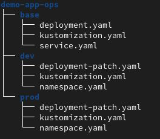
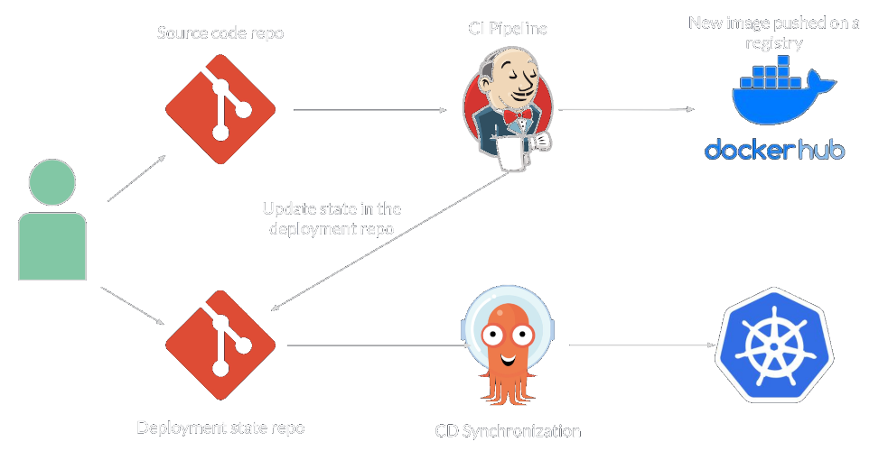

# GitOps with ArgoCD

## GitOps Principles

- Git as the single source of truth for the desired state of the system
- Application state in a declarative fashion
- Synchronisation between Git and deployment state by continuously diff and sync
- All changes through git commit

## Structure of a GitOps Deployment repo

- Distinct repo from the source code repo
- Contains all the manifests
- Separate folder or branch by environment
- One repo per Service (as in “Micro Service”)
- This repo should have limited access controls

## Typical GitOps workflow

## Why GitOps

- All changes in the state are versioned and verifiable
- Facilitates rollback and disaster recovery
- Fit perfectly Kubernetes and declarative manifests

## ArgoCD

- Kubernetes oriented
- Developed by Intuit - Accounting software, silicon
  valley based company
- Open Source - Apache 2.0
- Manual or auto-sync of k8s cluster state with deployment repo
- Helm, Kustomize or native K8s
- RBAC, muti-tenancy, SSO
- GUI and CLI for monitoring, troubleshooting
- Blue-Green, Canary deployment

## Remarks

- ArgoCD is very easy to install and intuitive. No reasons not to use it
- GitOps is straightforward, versioning your manifests is good practice
- K8s is not required for GitOps in theory, much more complicated in practice.
- Should be possible to version Ansible Inventories.
- Is auto sync your business critical production really worth it ?
